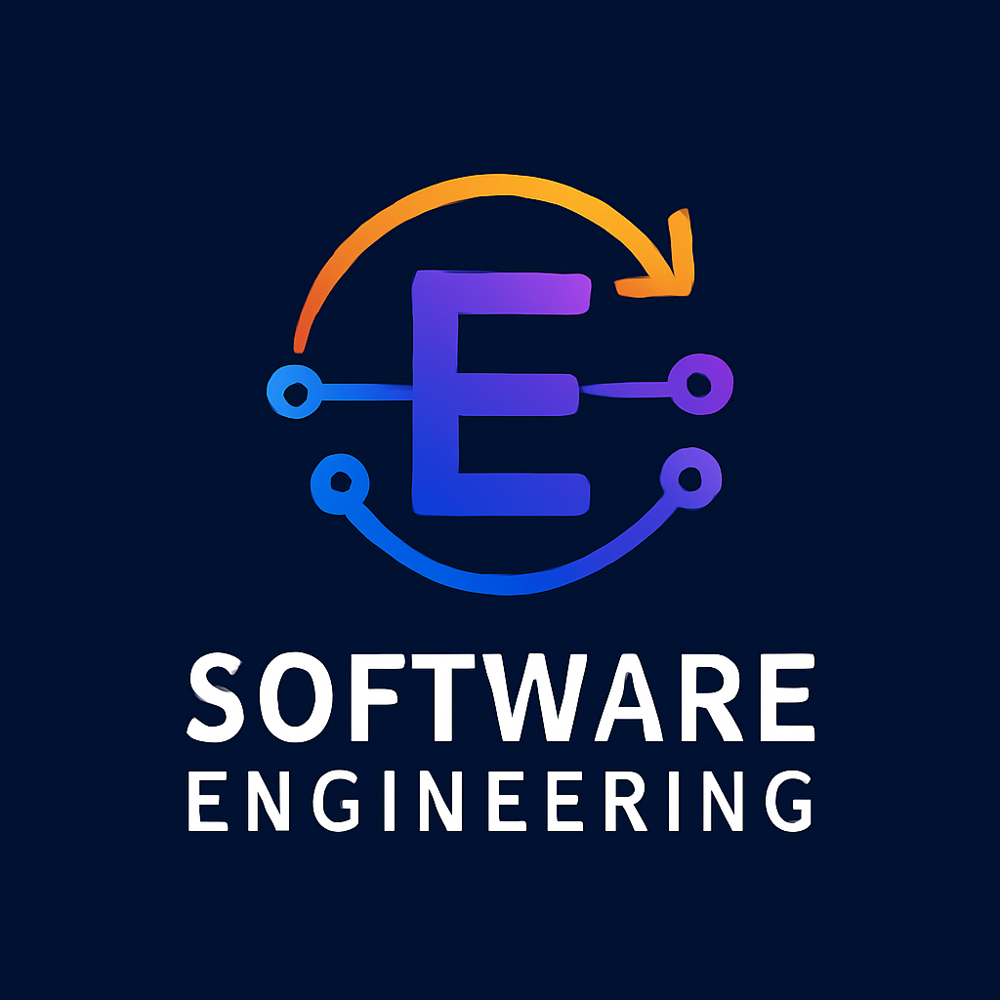

# ruanjiangongcheng
## This is the homepage for our team project

  

## 设计概念
### 1. 字母"E"的设计
- **简洁与现代**：字母"E"采用了几何化的设计，并运用了从深蓝到紫色的渐变色，这不仅展现了技术感，还传达了不断进步与创新的精神。
- **技术感**：字母内嵌有简化的电路图样，体现了"软件工程"的技术背景，同时也让Logo更加动态和富有生命力。
### 2. 协作与连接
- **箭头与节点**：围绕字母"E"的箭头代表了不断向前推进的技术发展，而箭头逐渐由橙色过渡到黄色，象征着激情与创造力的融合。箭头和节点的设计展现了团队之间紧密的协作与信息流动。
### 3. 未来感
- **流线型设计**：整体的图形结构采用了流线型的元素，给人一种未来感，象征着团队的技术敏捷性和创新精神。
- **配色方案**：渐变色的运用不仅带来了现代感，还突出了不断向前、探索未知的理念。
### 4. 简洁而有力的文字
- **字体选择**：Logo下方的"SOFTWARE ENGINEERING"采用了简洁、现代的无衬线字体，确保了在视觉上的清晰度，并增强了整体的专业感与现代感。
---
## 设计过程
### 构思阶段
基于团队风格（技术导向、注重协作和未来感）以及对"软件工程"主题的需求，设计师首先选择了字母"E"作为Logo的核心元素，并通过渐变色和抽象的电路符号体现技术感。
### 形状与图案设计
- 设计时，字母"E"周围围绕着箭头和连接的节点，象征着团队协作与技术发展
- 流线型和对称的设计增强了整体的和谐感
- 箭头的渐变色由橙色至黄色，不仅具有动感，还传递了积极、活力的情感
### 色彩与字体选择
- 采用深蓝色背景，使得Logo的主体部分更为突出
- 文字"SOFTWARE ENGINEERING"以白色呈现，确保在深色背景下具有高对比度
- 字体选择以现代、简洁为主，突出科技感和专业性

### 优化与调整
经过初步设计后，对元素的位置、比例、配色等进行了细微调整，确保在不同尺寸下，Logo依然能保持良好的辨识度，并且展现出和谐与平衡。
---
> **设计成果**：这个Logo成功地结合了团队的技术背景、协作精神和对未来的憧憬，同时具备了现代感和创新感，完美体现了软件工程的核心价值。

## 👥 团队介绍
我们是 **「写的都对」** —— 一个由12位充满热情的男生组成的软件工程团队。
### 🚀 团队特色
- **智慧集结**：12位成员，多元视角，协同解决复杂问题
- **技术全面**：覆盖前后端开发，掌握软件工程全流程技能
- **追求卓越**：不仅追求功能实现，更注重代码质量与用户体验
- **高效协作**：精细分工，默契配合，让每个项目都闪闪发光
### 💫 团队理念
我们相信：
> 写的不仅是代码，更是对技术的理解；
> 对的不仅是功能，更是对质量的执着。
**写的都对，做的更好！**
